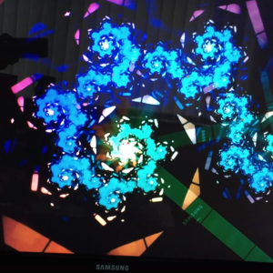
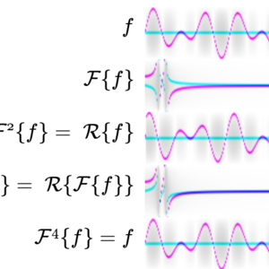
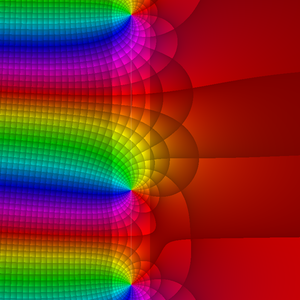
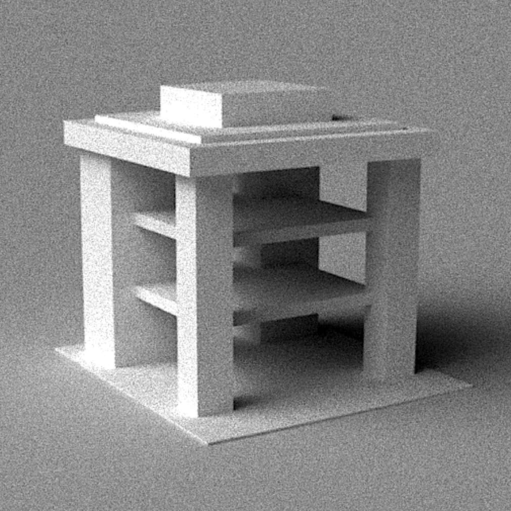

% GPU Accelerated Visualizations in Education
% Aaron Montag and Jürgen Richter-Gebert \
  Technical University of Munich, Germany
% Coimbra, June 29   </img></img>

# Technical Background
Tasks that initially were done on the CPU can now be *accelerated on the GPU*.

. . .

**However**: The *programming concepts* in conventional programming are quite difficult:

. . .

- Shaders/kernels are in separate language (GLSL, CUDA C...)

. . .

- The number of *lines of code* drastically increases

. . .

- GPU specific code often causes platform dependency

. . .

$\Rightarrow$ **additional development effort** is enormous, not suitable for education

--------------

# Our answer: CindyGL

- a plug-in for `CindyJS`, a `Cinderella` compatible framework for the web.

. . .

- Brings easy *shader programming* via `WebGL` into dynamic geometry software

- `WebGL`: a JavaScript API for interactive 3D and 2D graphics without the use of plug-ins.

. . .

- CindyGL translates a subset of CindyScript to GLSL $\rightarrow$ One programming language for *both the CPU and GPU*

. . .

- Aim: Making `WebGL` **easy** for *students and instructors*

--------------

# A minimal example

<iframe data-src="applets/cindyeditor.html?draw=colorplot(%0A%20%20x%5E2%2By%5E2-1%0A)%3B%0A%0A%0A%0A%0A%0A%0A%0A%0A%0A%0A%0A%0A%0A%0A%0A%0A%0A%0A%0A%0A%0A%0A%0A%0A%0A%0A%0A%0Astr%20%3D%20%22(%22%20%2B%20mouse().x%2B%22)%5E2%2B(%22%2Bmouse().y%2B%22)%5E2-1%22%3B%20%20%0Aval%20%3D%20parse(str)%3B%0A%0Adraw(mouse()%2C%20color-%3Egrey(val)%2C%20size-%3E20)%3B%0Adrawtext(mouse()%2B(-1.5%2C0)%2C%20%0A%20%20%20%20%20%20%20%20%20%22x%20%3D%20%22%20%2B%20%20mouse().x%20%2B%20%22%2C%0Ay%20%3D%20%22%20%2B%20mouse().y%2B%22%0A%22%2Bstr%2B%22%20%3D%20%22%20%2B%20val%2C%20color-%3E%5B1%2C0%2C0%5D%2C%20size-%3E25)%3B%0A%0A%20%20%20%20%20%20%20%20%20&init=resetclock()%3B&gslp=%5B%5D" class="cindyweb"></iframe>

. . .

For each pixel with coordinates $x$ and $y$ a grayscale-value is computed.

------------

# CindyGL in the classroom: Waves

Aim: simulate the *interference patterns of water waves*

. . .

An image of a single wave:

<iframe
data-src="applets/cindyeditor.html?draw=%2F%2F%20a%20single%20circular%20sinusoidal%20wave%20with%20point%20source%20A%0A%0Acolorplot(%0A%20%20%20sin(10*%7C(x%2Cy)-A%7C)%2F2%2B1%2F2%0A)%3B&init=resetclock()%3B%0A&gslp=%5B%7B%22alpha%22%3A1%2C%22color%22%3A%5B1%2C0%2C0%5D%2C%22labeled%22%3Atrue%2C%22name%22%3A%22A%22%2C%22size%22%3A5%2C%22type%22%3A%22Free%22%2C%22pos%22%3A%5B-0.42842590571441796%2C0.15715145622077145%2C1%5D%7D%5D" class="cindyweb"></iframe>

. . .

*seconds()* returns the exact time $\rightarrow$ enables animations.

--------------

# Two circular sinusoidal waves

Alternatively: the double slit experiment

<iframe data-src="applets/cindyeditor.html?draw=colorplot(%0A%20%20%20sin(10*%7C(x%2Cy)-A%7C-seconds())%0A%20%2B%20sin(10*%7C(x%2Cy)-B%7C-seconds())%0A)%3B&init=resetclock()%3B%0A&gslp=%5B%7B%22alpha%22%3A1%2C%22color%22%3A%5B1%2C0%2C0%5D%2C%22labeled%22%3Atrue%2C%22name%22%3A%22A%22%2C%22size%22%3A5%2C%22type%22%3A%22Free%22%2C%22pos%22%3A%5B1%2C0.2616039195461578%2C-0.8474729241877257%5D%7D%2C%7B%22alpha%22%3A1%2C%22color%22%3A%5B1%2C0%2C0%5D%2C%22labeled%22%3Atrue%2C%22name%22%3A%22B%22%2C%22size%22%3A5%2C%22type%22%3A%22Free%22%2C%22pos%22%3A%5B0.40468583599574026%2C0.1618743343982961%2C1%5D%7D%5D" class="cindyweb"></iframe>

. . .

Areas of *destructive interference* become immediately visible.

------------

# Why using GPU Accelerated Visualizations in Education?

**Instructors:**

- fast creation of appealing *visual teaching material*, which can be *easily shared*

. . .

**Students:**

 - *Interactive* generation of *visual* content
 - Strongly *motivates* the *visual learning type*
 - *Connect* learning contents from *Mathematics*, *Computer Science*, *Physics* and other fields
 
 ------------

# Colors in CindyGL

<iframe
data-src="applets/cindyeditor.html?draw=colorplot(%0A%20%20%20%20%20%20exp(-%7C(x%2Cy)-A%7C)*%5B1%2C0%2C0%5D%0A%20%20%09%2B%20exp(-%7C(x%2Cy)-B%7C)*%5B0%2C1%2C0%5D%0A%20%20%09%2B%20exp(-%7C(x%2Cy)-C%7C)*%5B0%2C0%2C1%5D%0A)%3B&init=resetclock()%3B%0A%0A&gslp=%5B%7B%22alpha%22%3A1%2C%22color%22%3A%5B1%2C0%2C0%5D%2C%22labeled%22%3Atrue%2C%22name%22%3A%22A%22%2C%22size%22%3A5%2C%22type%22%3A%22Free%22%2C%22pos%22%3A%5B1%2C0.6136863533519467%2C-0.9527948118410026%5D%7D%2C%7B%22alpha%22%3A1%2C%22color%22%3A%5B1%2C0%2C0%5D%2C%22labeled%22%3Atrue%2C%22name%22%3A%22B%22%2C%22size%22%3A5%2C%22type%22%3A%22Free%22%2C%22pos%22%3A%5B0.7897790036976036%2C-0.33502007553959207%2C1%5D%7D%2C%7B%22alpha%22%3A1%2C%22color%22%3A%5B1%2C0%2C0%5D%2C%22labeled%22%3Atrue%2C%22name%22%3A%22C%22%2C%22size%22%3A5%2C%22type%22%3A%22Free%22%2C%22pos%22%3A%5B-0.5652173913043479%2C0.8260869565217391%2C1%5D%7D%5D"  class="cindyweb"></iframe>

. . .

If *colorplot* outputs a three component-vector, the color is obtained by additive mixing of *red*, *green* and *blue*.

--------------

# Phase portraits of complex functions.

Assign colors to complex numbers based on their argument [@wegert2012visual].

<iframe
data-src="applets/cindyeditor.html?draw=%2F%2Fa%20complex%20function%0A%0Af(z)%20%3A%3D%20z%5E7-1%3B%0A%0Acolorize(z)%20%3A%3D%20(%0A%20%20phase%20%3D%20im(log(z))%3B%0A%20%20hue(phase%2F(2*pi))%3B%0A)%3B%0A%0Acolorplot(%0A%20%20%20%20colorize(f(z))%0A)%3B%0A%0A%0A%0A%0A%0A%0A%0A%0A%0A%0A%0A%0A%0A%0A%0A%0A%0A%0A%0A%0A%0A%0Aforall(-2..2%2C%20h%2C%0A%09draw((-3%2Ch)%2C(3%2Ch)%2Ccolor-%3E%5B.5%2C.5%2C.5%5D%2Calpha-%3E.5)%3B%0A%20%20%20%20%20%20%20draw((h%2C-3)%2C(h%2C3)%2Ccolor-%3E%5B.5%2C.5%2C.5%5D%2Calpha-%3E.5)%3B%0A)%3B%0Adrawcircle((0%2C0)%2C1%2Ccolor-%3E%5B.5%2C.5%2C.5%5D%2Calpha-%3E.5)%3B%0A%0Aforall(apply(directproduct(-2..2%2C-2..2)%2Cp%2C%20complex(p))%2C%20z%2C%20drawtext(gauss(z)%2C%22%24%22%2Bz%2B%22%24%22%2Calign-%3E%22mid%22))%3B%0A%0A%0A%0A&init=resetclock()%3B&gslp=%5B%5D" class="cindyweb"></iframe>

$z=x+i \cdot y$ is the pixel coordinate as complex number.

--------------

# Convergence discs of Taylor series

<iframe data-src="applets/taylor.html" class="cindyweb"></iframe>

phase portrait of a function $f:\mathbb{C}\to\mathbb{C}$.

Approximation $\sum_{k=0}^n \frac{f^{(k)}(a)}{k!} (z-a)^k$ through Taylor polynomials

--------------

# Deformation of images

<iframe data-src="applets/cindyeditor.html?draw=colorplot(%0A%20%20%20%20imagergb(%22image%22%2C%0A%20%20%20%20%09(x%2Cy)%20%20%20%20%20%20%20%20%0A%20%20%20%20)%0A)%3B&init=resetclock()%3B&gslp=%5B%5D" class="cindyweb"></iframe>

For each pixel we look up a color in a texture at the given coordinates.

--------------

# Deformation of images (complex)

<iframe data-src="applets/cindyeditor.html?draw=colorplot(%0A%20%20%20%20imagergb(%22image%22%2C%0A%20%20%20%20%09z%0A%20%20%20%20)%0A)%3B&init=resetclock()%3B%0A%0Acamera%20%3D%20cameravideo()%3B&gslp=%5B%7B%22alpha%22%3A1%2C%22color%22%3A%5B1%2C0%2C0%5D%2C%22labeled%22%3Atrue%2C%22name%22%3A%22A%22%2C%22size%22%3A5%2C%22type%22%3A%22Free%22%2C%22pos%22%3A%5B1%2C0.7514970059880242%2C0.7193113772455091%5D%7D%5D" class="cindyweb"></iframe>

. . .

Also access to the webcam is possible

--------------

# Raycasting

Aim: render the surface $x^2+y^2+z^2 - 1 = 0$

<iframe data-src="applets/cindyeditor.html?draw=lightnormal%20%3D%20%5BA.x%2CA.y%2C-1%5D%3B%0Alightnormal%20%3D%20%20lightnormal%2F%7Clightnormal%7C%3B%0Alightcolor%20%3D%20%5B1.2%2C1%2C.8%5D%3B%0Abackground%20%3D%20%5B.4%2C.4%2C.4%5D%3B%0A%0Acolorplot(%0A%20if(%7Cx%5E2%2By%5E2%7C%3C1%2C%20%20%20%20%0A%20%20s%3D(x%2Cy%2C-%7Csqrt(1-x%5E2-y%5E2)%7C)%3B%20%0A%20%20(s*lightnormal)*lightcolor%2C%0A%20%20background%0A%20)%0A)%3B&init=resetclock()%3B&gslp=%5B%7B%22alpha%22%3A1%2C%22color%22%3A%5B1%2C0%2C0%5D%2C%22labeled%22%3Atrue%2C%22name%22%3A%22A%22%2C%22size%22%3A5%2C%22type%22%3A%22Free%22%2C%22pos%22%3A%5B-0.7053627237916317%2C0.522846461941697%2C1%5D%7D%5D" class="cindyweb"></iframe>

The intersection of the ray behind each pixel with the surface is computed.

---------------

# Raycasting (Advanced)

<iframe data-src="applets/raycasting.html" style="width:900px; height:600px;"></iframe>

---------------

# The stereographic projection

<iframe data-src="applets/stereographic/index.html" style="width:900px; height:600px;"></iframe>

---------------

# Editing spherical images

<iframe data-src="applets/spherical/index.html" style="width:900px; height:600px;"></iframe>

--------------

# The (spherical) Droste effect

<iframe data-src="applets/droste/index.html" style="width:900px; height:650px;"></iframe>

<!--Is being used by *Matt Parker* in *Festival of the Spoken Nerd*.-->

--------------

# Further Applications of `CindyGL`

<a href="applets/cindyeditor.html?draw=N%20%3D%20251%3B%20%2F%2F%20maximal%20number%20of%20iterations%0Acolorplot(%0A%20%20c%20%3D%20((x%2Bi*y)*exp(-mod(seconds()%2C10))%2B(-0.7436439%20%2B%200.1318259*i))%3B%0A%20%20z%20%3D%200%3B%20n%20%3D%200%3B%0A%20%20repeat(N%2C%20k%2C%0A%20%20%20%20if(%7Cz%7C%20%3C%3D%204%2C%0A%20%20%20%20%20%20%20z%3Dz*z%2Bc%3B%0A%20%20%20%20%20%20%20n%20%3D%20k%3B%0A%20%20%20%20)%3B%0A%20%20)%3B%0A%20%20grey(n%2FN)%0A)%3B&init=resetclock()%3B&gslp=%5B%5D">Fractals \& Limit sets</a>

<a href="https://montaga.github.io/tdot/index.html">Feedbackloops</a>

<a href="https://interactive.app.tum.de/web/09_ME/2">Volumetric Rendering</a>

<a href="https://cindyjs.org/examples/cindygl/31_fft.html">FFT</a>

<a href="https://cindyjs.org/gallery/cindygl/ComplexExplorer/index.html">Complex Analysis</a>

<a href="http://localhost/cindyjs/examples/cindygl/47_analyticlandscape_descartes.html">Analytic Landscapes</a>

<a href="https://cindyjs.org/gallery/main/ReactionDiffusion/">Partial Differential Equations</a>

<a href="https://interactive.app.tum.de/web/07_MW/2">Fluid Simulation</a>

<a href="https://cindyjs.org/gallery/main/Jugglers/">Video-Deformations with Henry Segerman</a>

<a href="https://interactive.app.tum.de/web/04_EI/2">Vectorfields (LIC)</a>

<a href="https://cindyjs.org/gallery/main/CoxeterTilings/">Hyperbolic Geometry</a>

<a href="https://cindyjs.org/examples/cindygl/48_molecules.html">N-body Simulation</a>

<a href="https://cindyjs.org/examples/cindygl/40_waveintersection.html">Quasicrystals</a>

<!--
<a href="http://cindyjs.org/examples/cindygl/17_images_blur.html">Image Filters</a>
-->

<a href="https://interactive.app.tum.de/web/01_AR/2">Monte Carlo Raytracing</a>

<a href="https://interactive.app.tum.de/web/14_WZW/2">Celluar Automata</a>

  
--------------

# Thank you!
More information on [cindyjs.org](https://cindyjs.org/).

Tutorial for CindyGL: [cindyjs.org/docs/cindygltutorial/](https://cindyjs.org/docs/cindygltutorial/)

### References

[@stussak2009realsurf]
<!--[@jobard2002lagrangian]-->
<!--[@epstein]-->
<!--[@montag]-->
[@cindyjs]
[@cindygl]
[@wegert2012visual]
<!--[@olsen2010geometry]-->
<!--[@herlihy2011art]-->
[@schleimer2016squares]
[@pycuda]

