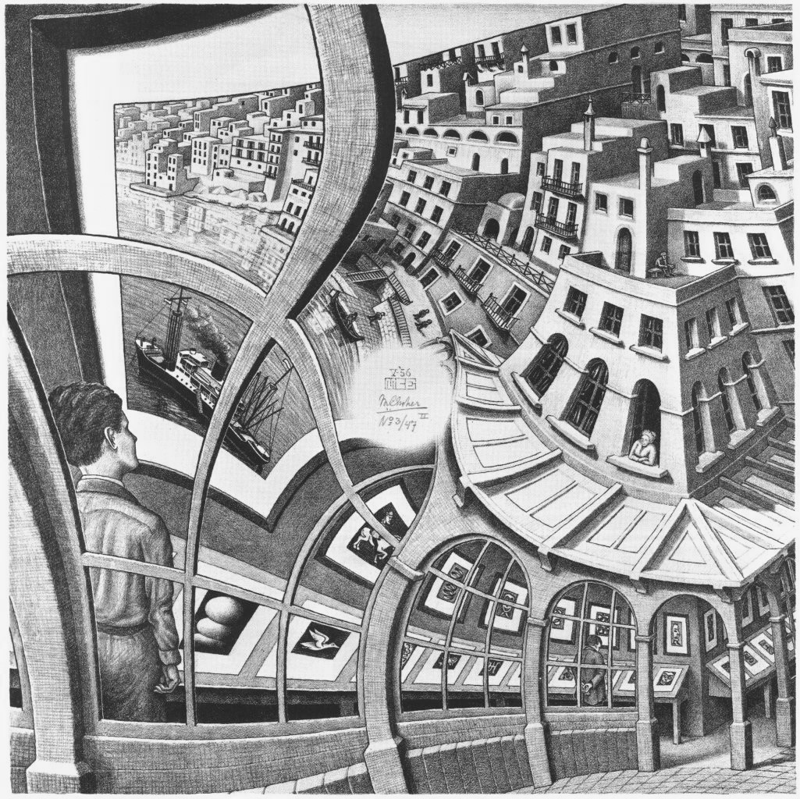

% The Spherical Droste Effect
% Aaron Montag
  Raitenhaslach, Germany
% DGD Days 04.10. - 06.10.2017

---------------

## Spherical Images and Videos

Let $\mathcal{C}$ be the RGB *color* space.

. . .

Almost universally, spherical images and videos are stored
and transmitted via equirectangular projection.

$$c:(0, 2 \pi) \times (-\tfrac{\pi}{2},\tfrac{\pi}{2}) \to \mathcal{C}.$$

</img>

---------------

## How to edit these images?

Rotation of an image on vertical axis is simple: shift the image.

<iframe data-src="applets/51_tum_marquee.html" width="800" height="400"></iframe>
. . .

**Aim 1**: How to rotate a spherical image about a non-vertical axis?

. . .

**Aim 2**: Apply other *meaningful* transformations.

---------------

# Map the image to $\hat{\mathbb{C}} \approx \mathbb{C P}^1$!

. . .

(First map the equirectangular projection to $S^2$ and then map it to $\mathbb{C} \cup \{\infty \} = \hat{\mathbb{C}}\approx \mathbb{C P}^1$ via the Stereographic projection)

---------------

# Conformity matters

<iframe data-src="applets/51_world_pullback.html" class="cindy"></iframe>

**Lemma:** The Stereographic Projection $SP: S^2 \to \hat{\mathbb{C}}$, $(u,v,w) \mapsto \tfrac{u}{1-w} + i \tfrac{v}{1-w}$ is bi-conformal.
<!--
\begin{eqnarray}
SP: &S^2 &\to& \hat{\mathbb{C}},\\
&(u,v,w) &\mapsto& \tfrac{u}{1-w} + i \tfrac{v}{1-w}
\end{eqnarray}-->

$\rightarrow$ it is bijective and it and its inverse preserve all angles (and orientation).

---------------

## Pullbacks of $f : \hat{\mathbb{C}} \to \hat{\mathbb{C}}$
<iframe data-src="applets/51_world_pullback.html" class="cindy"></iframe>

Let $f: \hat{\mathbb{C}} \to \hat{\mathbb{C}}$ be a function.

Then $d = SP^{-1} \circ f \circ SP: S^2 \to S^2$ is called the *pullback of $f$*.

. . .

**Creating Images:** Good images of a pullback are obtained by computing the following map for each pixel:

$$\{1, \dots, 1024\} \times \{1, \dots, 768\} \hookrightarrow \mathbb{C} \hookrightarrow \hat{\mathbb{C}} \to^{f} \hat{\mathbb{C}} \\
\to^{SP^{-1}} S^2 \to (0, 2 \pi) \times (-\tfrac{\pi}{2},\tfrac{\pi}{2}) \to^{c} \mathcal{C}$$

---------------

# The Droste Effect

</img>

---------------

# Generation of the Droste Effects
<iframe data-src="applets/51_garching_pullback.html" class="cindy"></iframe>

- Consider the image in polar-like coordinates by taking the $\log$ of the image.

- Replicate the annulus via taking the mod of the real part.

- Pull back this change in the modulus by taking the $\exp$ of the image.

[Live demo](applets/51_ricoh_moeb_pullback.html)

[Droste on Rectangles](applets/51_ricoh_rect_droste.html)

[https://montaga.github.io/droste/](https://montaga.github.io/droste/)

---------------

# Twisted Droste Effect

</img> </img>

Eschers Print Gallery
[https://montaga.github.io/droste/](https://montaga.github.io/droste/)

---------------

# Twist spherical images!
<iframe data-src="applets/51_garching_pullback_twist.html" class="cindy"></iframe>

- **Idea:** Rotate the replicated $log$-deformed image. But how far such that this rotation is compatible with the consecutive $exp$-deformation?

. . .

- **More formal:** $\sim$ is the equivalence relation with $z \sim w$ if $z$ and $w$ show the same part of the image. Have $z \sim z + 2 \pi i$ and $z \sim z + p$ ($p$: period of the repeated $log$-deformed image). **Which parameter $\alpha \in \mathbb{C}$ fulfills $\alpha z \sim \alpha z + 2 \pi i$?**

. . .

$\alpha z \sim \alpha (z + p + 2 \pi i) = \alpha z + \alpha (p+2 \pi i)$. Hence for $\alpha:=\tfrac{2 \pi i}{p+2 \pi i}$ holds $\alpha z \sim \alpha z + 2 \pi i$.

---------------

# Live Demo

[Pullback of Functions](applets/51_ricoh_moeb_pullback.html)

[Droste on Rectangles](applets/51_ricoh_rect_droste.html)

[Droste with a green-box](applets/51_ricoh_greenbox_droste_feather.html)

[https://montaga.github.io/droste/](https://montaga.github.io/droste/)

---------------

# Thank you!

### References

<!--[@stussak2009realsurf]-->
<!--[@jobard2002lagrangian]-->
<!--[@epstein]-->
<!--[@montag]-->
[@de2003mathematical]
[@cindygl]
[@olsen2010geometry]
[@schleimer2016squares]
[@biederman1987recognition]

